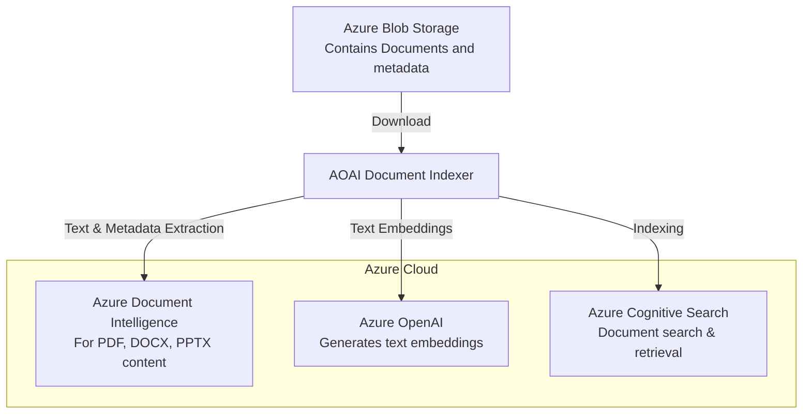

### AOAI Document Indexer Demo

The AOAI Document Indexer is an automated solution tailored to download, process, and index an assortment of documents such as PDFs, Word documents (.docx), and PowerPoint files (.pptx) stored in an Azure Blob Storage account. It leverages Python to perform text extraction, text embeddings using Azure OpenAI, and employs Azure Cognitive Search alongside Azure Document Intelligence (formerly known as Form Recognizer) to efficiently index and make the documents searchable.

#### Usage Instructions

1.  Clone the repository to your local machine.
    
2.  Install Python 3.6 or higher.
    
3.  Navigate to the repository directory.
    
4.  Install the necessary package dependencies by executing:
    
    ```
    pip install -r requirements.txt
    ```
    
5.  Create a  `.env`  file with your Azure service credentials to set up the required environment variables.
    
6.  Ensure each document in the Azure Blob Storage has a corresponding  `.metadata.txt`  with at least two lines of metadata.
    
7.  Run the tool using the command:
    
    ```
    python test.py  
    ```
    

#### Metadata File Requirement

A crucial prerequisite for the indexing process is the presence of a  `.metadata.txt`  file alongside each document in the Blob Storage. The  `.metadata.txt`  file should contain at least two lines of text, where:

-   The first line is treated as the source URL of the document.
-   The second line is used for tagging purposes and can include descriptors or keywords that pertain to the document.

This metadata becomes part of the indexed information and is instrumental in enhancing the search functionality within Azure Cognitive Search.

#### Architecture Overview



The diagram above depicts the flow of data and the integration of different Azure services within the AOAI Document Indexer system:

1.  Documents and their corresponding metadata files are stored in Azure Blob Storage.
2.  The AOAI Document Indexer downloads the documents and  `.metadata.txt`  files.
3.  Azure Document Intelligence is utilized for content extraction from documents.
4.  Azure OpenAI is used to generate text embeddings to enhance semantic search capabilities.
5.  Azure Cognitive Search is where all the indexed data is stored, allowing for efficient searching and retrieval.

#### Azure AI Integration Detail

-   **Azure Cognitive Search:**  Offers advanced search capabilities, managing and querying the indexed data.
-   **Azure OpenAI:**  Enhances search by providing vector embeddings for semantic understanding, allowing users to search by meaning rather than specific keywords.
-   **Azure Document Intelligence:**  Extracts content from documents, converting them into structured data that can be indexed and searched.

#### Developer Notes

Developers must ensure the secure handling of Azure service credentials in  `.env`  files and comply with organizational security policies in production environments.

Adherence to the metadata file requirement is imperative for the proper functioning of the indexer, as it provides valuable context that enriches the search experience.

#### Maintainer’s Note:

The demonstration of the AOAI Document Indexer here is a simplified model for usage illustration purposes. It is strongly recommended to adopt security best practices for production deployments, including credential management, error handling strategies, and performance optimization to cater to your specific organizational needs and use cases.
